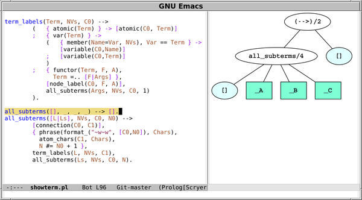

# Showterm: Draw Prolog terms as trees in Emacs

To try it, you need the following programs installed:

- [**Scryer Prolog**](https://github.com/mthom/scryer-prolog)
- `dot` (from Graphviz)
- `convert` (from ImageMagick)

Copy [`showterm.el`](showterm.el) and [`showterm.pl`](showterm.pl) to
the same directory, say `~/scryer-prolog/tools/`, and add to your
`.emacs`:

    (load "~/scryer-prolog/tools/showterm.el")

If necessary, set `scryer-prolog-path` to the Scryer Prolog
executable by adding to your `.emacs` (adapting as appropriate):

    (setq scryer-prolog-path "/usr/local/bin/scryer-prolog")

The function `showterm` draws the Prolog term in the region as
a&nbsp;tree. You can invoke it with `M-x showterm RET`, or for example
by binding it to a key in your `.emacs`, and then pressing
that&nbsp;key:

    (global-set-key [f12] 'showterm)

Enjoy!

**Screenshot:**

